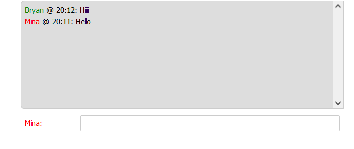

# SimpleChatApp
A fun, simple web-based chat app, made with Node.js and Websockets. Compression Implementation available

##Dependencies:
    "finalhandler": "^1.1.2",
    "http": "0.0.1-security",
    "permessage-deflate": "^0.1.7",
    "serve-static": "^1.14.1",
    "websocket": "^1.0.34",
    "websocket-extensions": "^0.1.4"
##How to run?
node front-server.js
localhost:1337/frontend.html
